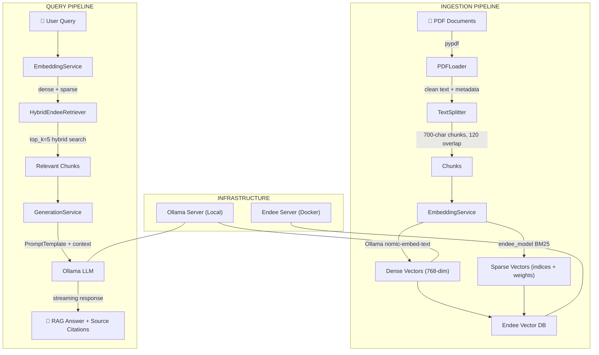

# Endee RAG System

A modular, production-grade, **100% offline** Retrieval-Augmented Generation (RAG) system built with **Endee Vector DB**, **Ollama LLMs**, and a **Streamlit** chat interface, orchestrated with Docker/Podman.

---

## System Architecture



---

## Project Structure

```
endee_vector_db_rag/
├── config/
│   └── settings.py             # Pydantic settings (loads .env)
├── core/
│   ├── loader.py               # PDFLoader — extracts & cleans text from PDFs
│   ├── splitter.py             # TextSplitter — character-level chunking with overlap
│   ├── embeddings.py           # EmbeddingService — dense (Ollama) + sparse (BM25) embeddings
│   ├── database.py             # DatabaseService — Endee index CRUD & hybrid upsert/query
│   ├── retriever.py            # HybridEndeeRetriever — LangChain-compatible retriever
│   └── generator.py            # GenerationService — prompt formatting + Ollama LLM streaming
├── expr/
│   ├── speed_test.py           # Benchmark: Endee retriever speed for 5 queries
│   ├── advanced_test.py        # Benchmark: 8 advanced reasoning queries
│   ├── compare_dbs.py          # Benchmark: Endee vs Chroma DB speed comparison + chart
│   ├── chroma_retr.ipynb       # Notebook: Chroma hybrid retriever (for comparison)
│   └── db_comparison_chart.png # Generated comparison line chart
├── tests/
│   ├── test_loader.py          # Pytest: PDFLoader tests
│   └── test_retriever_printer.py # Manual: retrieve & print chunks for a query
├── docs/                       # Uploaded PDF documents (created at runtime)
├── nltk_data/                  # Local NLTK data (stopwords, punkt_tab)
├── main.py                     # CLI entry point (ingest / ask)
├── streamlit_app.py            # Streamlit chat UI
├── docker-compose.yml          # Endee server container
├── .env                        # Environment variables
├── requirements.txt            # Python dependencies
└── README.md
```

---

## Exact Flow

### Flow 1: Document Ingestion

```
PDF file → PDFLoader → TextSplitter → EmbeddingService → Endee Vector DB
```

**Step-by-step:**

1. **PDFLoader** (`core/loader.py`) reads the PDF using `pypdf`, extracts text page-by-page, removes null characters, and normalizes whitespace. Returns `(page_text, metadata)` tuples where metadata includes `filename`, `page`, and `source`.

2. **TextSplitter** (`core/splitter.py`) splits each page's text into chunks of **700 characters** with **120-character overlap** to preserve context continuity across chunk boundaries.

3. **EmbeddingService** (`core/embeddings.py`) generates two types of embeddings for each chunk:
   - **Dense embedding (768-dim):** Calls Ollama's `/api/embeddings` endpoint with `nomic-embed-text:latest`. Batch processing uses `ThreadPoolExecutor` with 5 workers.
   - **Sparse embedding (BM25):** Uses the local `endee_model.SparseModel` (`endee/bm25`) to generate sparse indices and values for keyword-level matching.

4. **DatabaseService** (`core/database.py`) creates/ensures the Endee index with HNSW parameters (`M=32`, `ef_con=256`, `cosine` space, `float32` precision) and upserts points in batches of 64. Each point contains:
   - `id` — SHA-256 hash of `filename + chunk_text` (deduplication)
   - `vector` — 768-dim dense vector
   - `sparse_indices` / `sparse_values` — BM25 sparse components
   - `meta` — `{text, filename, page, source, chunk_id}`

### Flow 2: Query & Retrieval

```
User Query → EmbeddingService → HybridEndeeRetriever → GenerationService → Streamed Answer
```

**Step-by-step:**

1. **User submits a query** through the Streamlit chat UI or CLI (`main.py ask --query "..."`).

2. **EmbeddingService** generates **dense** and **sparse** embeddings for the query (sparse uses `query_embed` mode for query-optimized BM25 scoring).

3. **HybridEndeeRetriever** (`core/retriever.py`) performs a **hybrid search** on the Endee index, combining both dense semantic similarity and sparse keyword matching. Returns the top-k (default 5) most relevant chunks as LangChain `Document` objects, each with metadata including source links.

4. **GenerationService** (`core/generator.py`) formats the retrieved chunks into a context string, builds the final prompt using a `PromptTemplate`, and **streams** the response from the Ollama LLM token-by-token. Performance metrics (retrieval time, LLM time, tokens/sec) are tracked throughout.

5. **Response is displayed** with source citations linking back to the original PDF documents.

### Flow 3: Streamlit Chat UI

```
Browser → Streamlit App → [Sidebar: Upload & Ingest] + [Chat: Query Pipeline]
```

**Step-by-step:**

1. On startup, `streamlit_app.py` initializes `EmbeddingService`, `DatabaseService`, `HybridEndeeRetriever`, and `GenerationService`, caching them in `st.session_state`.

2. **Sidebar** allows uploading PDF manuals and triggering ingestion (calls `main.ingest()`). Includes a "Fresh Start" option to wipe and recreate the index.

3. **Chat interface** takes user queries, runs the full query pipeline (retrieve → generate), and streams the LLM response in real time with a typing cursor indicator.

4. **Source citations** are shown in expandable sections with clickable links to the original document pages.

5. **Performance metrics** (tokens/sec, latency, retrieval time) are displayed below each response.

---

## Setup Instructions

### 1. Prerequisites

| Component | Purpose |
|---|---|
| **Docker / Podman** | Run the Endee Vector DB server |
| **Ollama** | Serve embedding + LLM models locally |
| **Python 3.10+** | Run the application |

### 2. Environment Configuration

Create a `.env` file in the project root:

```env
# Ollama Configuration
OLLAMA_URL=http://localhost:11434
OLLAMA_EMBED_MODEL=nomic-embed-text:latest
OLLAMA_LLM_MODEL=qwen3:0.6b

# Endee Database Configuration
ENDEE_URL=http://localhost:8080
ENDEE_INDEX_NAME=cnc_hybrid_vdb

# RAG Settings
TOP_K=5
DOC_SERVER_URL=http://localhost:8003
NLTK_DATA_PATH=./nltk_data
```

### 3. Start Endee Vector DB

```bash
# Start the Endee server container
docker-compose up -d
```

### 4. Pull AI Models into Ollama

```bash
# Embedding model
ollama pull nomic-embed-text:latest

# LLM model
ollama pull qwen3:0.6b
```

### 5. Setup Python Environment

```bash
# Create and activate virtual environment
python3 -m venv venv
source venv/bin/activate

# Install dependencies
pip install -r requirements.txt
```

### 6. Ingest Documents

```bash
# Ingest a single PDF
python main.py ingest --path /path/to/manual.pdf

# Ingest all PDFs in a directory
python main.py ingest --path /path/to/docs/

# Wipe index and re-ingest
python main.py ingest --path /path/to/docs/ --recreate
```

### 7. Run the Application

```bash
# Option A: Streamlit Chat UI (recommended)
streamlit run streamlit_app.py

# Option B: CLI query
python main.py ask --query "How to fix motor overload issue?"
```

---

## Benchmarking & Experiments

All benchmark scripts are located in the `expr/` directory.

### Retriever Speed Test

```bash
# Measure retrieval speed for 5 queries
python expr/speed_test.py
```

### Advanced Reasoning Test

```bash
# Test retriever with 8 advanced reasoning queries
# (ambiguity traps, contradiction, multi-section reasoning)
python expr/advanced_test.py
```

### Endee vs Chroma DB Comparison

```bash
# Run head-to-head speed comparison + generate line chart
python expr/compare_dbs.py
```

**Sample Results:**

| Database | Avg Retrieval Time (5 queries) |
|---|---|
| **Endee DB** | **~0.05 sec** |
| Chroma DB | ~0.40 sec |

> Endee DB is approximately **8x faster** than Chroma DB for hybrid retrieval on the same dataset and queries.

---

## Data Schema

Each point stored in the Endee Vector Database:

```json
{
    "id": "sha256_hash_of_filename_and_chunk",
    "vector": [0.12, -0.05, ...],
    "sparse_indices": [102, 456, 1092],
    "sparse_values": [1.45, 0.88, 2.11],
    "meta": {
        "text": "Actual text content of the chunk...",
        "filename": "/path/to/v1_rag_cnc.pdf",
        "page": 13,
        "source": "pdf",
        "chunk_id": 0,
        "link": "http://localhost:8003/v1_rag_cnc.pdf"
    }
}
```

---

## Key Design Decisions

- **Offline-First:** Zero reliance on external APIs. All embeddings and generation happen locally via Ollama.
- **Hybrid Search:** Dense (semantic) + Sparse (BM25 keyword) retrieval for maximum precision and recall.
- **LangChain Integration:** `HybridEndeeRetriever` extends `BaseRetriever` for seamless use in LangChain pipelines.
- **Deduplication:** SHA-256 content hashing prevents duplicate chunks during multi-file ingestion.
- **Streaming Generation:** Token-by-token LLM output for responsive UI experience.
- **Clean Architecture:** Separation of concerns across loader, splitter, embeddings, database, retriever, and generator modules.

---

## Tech Stack

| Layer | Technology |
|---|---|
| Vector Database | Endee Vector DB |
| Embeddings | Ollama + nomic-embed-text (768-dim) |
| Sparse Model | endee_model BM25 |
| LLM | Ollama (qwen3 / gemma4 / gpt-oss) |
| Framework | LangChain |
| UI | Streamlit |
| Configuration | Pydantic Settings + .env |
| Container Runtime | Docker / Podman |
| Testing | pytest |
