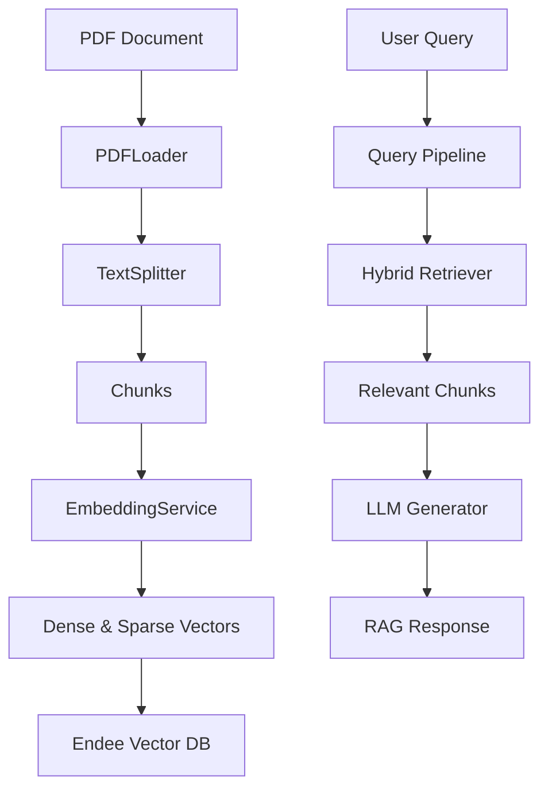

# Endee RAG System

A modular, production-grade RAG (Retrieval-Augmented Generation) system built for 100% offline usage. Orchestrated with Podman/Docker for reliability and scalability.

## Architecture Overview



## Setup Instructions (From Scratch)

### 1. Prerequisites
- **Podman** (or Docker) and **podman-compose**
- **Python 3.10+** (if running scripts locally)
- NLTK data directory (defaults to `~/nltk_data`)

### 2. Environment Configuration
Create a `.env` file in the root directory. Ensure it contains the following (adjust paths as needed):

```env
# Ollama Configuration
OLLAMA_URL=http://localhost:11434
OLLAMA_EMBED_MODEL=nomic-embed-text:latest
OLLAMA_LLM_MODEL=qwen3:0.6b

# Endee Database Configuration
ENDEE_URL=http://localhost:8080
ENDEE_INDEX_NAME=cnc_hybrid_vdb

# RAG Settings
TOP_K=5
DOC_SERVER_URL=http://localhost:8003
NLTK_DATA_PATH=/Users/your-user/nltk_data
```

### 3. Build & Orchestrate
Deploy the entire stack with a single command:

```bash
# Build and start services
podman-compose up -d --build
```

### 4. Pull AI Models
The models must be pulled inside the specialized Ollama container before first use:

```bash
# Pull the Embedding Model
podman exec -it ollama ollama pull nomic-embed-text:latest

# Pull the LLM (Qwen3 0.6B)
podman exec -it ollama ollama pull qwen3:0.6b
```

## Usage

### 🚀 AI Chat Interface
Once the containers are running, access the premium chat interface at:
**[http://localhost:8501](http://localhost:8501)**

### 📂 Document Synchronization
You can upload PDFs through the sidebar in the Web UI. For batch ingestion via CLI:
```bash
# From inside the container
podman exec -it rag-app python main.py ingest --path /app/docs/manual.pdf
```

### 🕵️ Retriever Diagnostics
To verify exactly which chunks are being retrieved and inspect metadata:
```bash
podman exec -it rag-app python tests/test_retriever_printer.py "Your test query"
```

## Performance & Optimizations

- **Offline-First**: Zero reliance on external APIs. All generation and embeddings happen locally via Ollama.
- **Hybrid Search**: Combines dense semantic search with sparse keyword search (BM25) for maximum precision.
- **Named Volumes**: Data persistence for `endee-db` and `ollama` is handled via named volumes to survive container restarts.
- **Metrics Tracking**: Real-time monitoring of retrieval latency, generation time, and tokens per second (TPS).

## Features
- **Podman Ready**: Optimized for rootless deployment.
- **Glassmorphic UI**: High-end Streamlit interface with source citations.
- **Production-Ready**: Includes document serving, healthchecks, and robust volume management.

## Data Schema

Each point stored in the Endee Vector Database follows this schema:

```json
{
    "id": "chunk_counter_001",
    "vector": [0.12, -0.05, ... ],        // 768-dim dense vector
    "sparse_indices": [102, 456, 1092],   // BM25 sparse indices
    "sparse_values": [1.45, 0.88, 2.11],  // BM25 weights
    "meta": {
        "text": "Actual text content...",
        "filename": "v1_rag_cnc.pdf",
        "page": 13,
        "link": "http://localhost:8003/v1_rag_cnc.pdf"
    }
}
```
