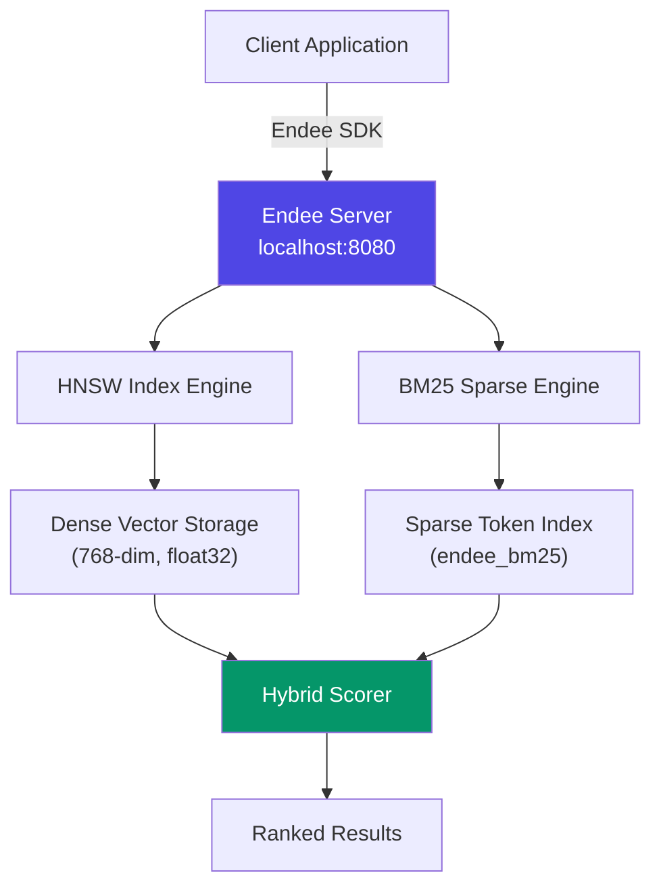
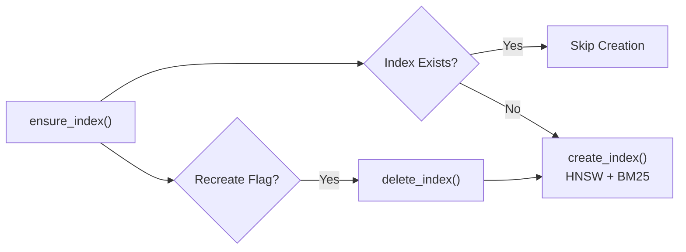
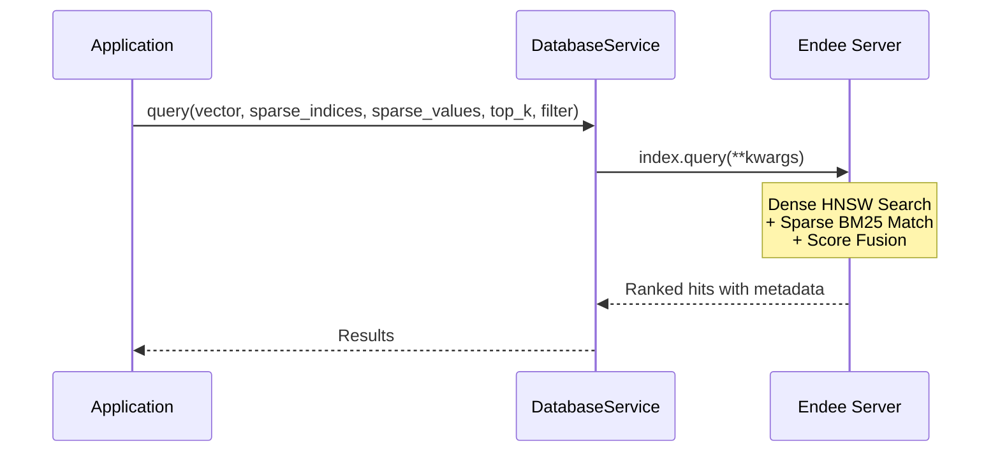

# Endee Vector Database

## Overview

Endee is the custom vector database engine that serves as the backbone of this RAG system. It provides **hybrid search** capabilities by combining dense vector similarity (HNSW) with sparse keyword matching (BM25) in a single query, delivering superior retrieval accuracy compared to either approach alone.

## Architecture



## Core Configuration

| Parameter | Value | Purpose |
|-----------|-------|---------|
| `endee_url` | `http://localhost:8080` | Server endpoint |
| `endee_index_name` | `cnc_hybrid_vdb` | Primary index name |
| `dense_dim` | `768` | Embedding dimension (nomic-embed-text) |
| `space_type` | `cosine` | Distance metric |
| `endee_m` | `32` | HNSW graph connectivity |
| `endee_ef_con` | `256` | HNSW construction quality |
| `endee_precision` | `float32` | Vector storage precision |
| `sparse_model` | `endee_bm25` | Built-in BM25 model |

## Key Operations

### Index Management



### Hybrid Query Flow



## Implementation Details

### File: `core/database.py`

| Method | Description |
|--------|-------------|
| `ensure_index(recreate)` | Creates or recreates the HNSW+BM25 index |
| `get_index()` | Returns the active index handle |
| `upsert_batch(index, points)` | Batch inserts document vectors |
| `query(index, vector, sparse, top_k, filter)` | Performs hybrid search |
| `delete_by_filter(index, filter)` | Removes documents by metadata filter |

## Data Point Structure

Each document chunk is stored as a point with the following structure:

```json
{
  "id": "unique_chunk_id",
  "vector": [0.12, -0.34, ...],       
  "sparse_indices": [1, 45, 892],     
  "sparse_values": [0.8, 0.6, 0.3],   
  "meta": {
    "text": "Original chunk text...",
    "filename": "/path/to/manual.pdf",
    "page": 12,
    "source": "pdf",
    "dept": "maintenance"
  }
}
```

## Why Endee?

- **Offline-First**: Runs locally via Docker, no cloud dependency
- **Hybrid Search**: Combines semantic understanding (dense) with exact keyword matching (sparse) in a single query
- **Metadata Filtering**: Supports field-level filters (e.g., `dept=maintenance`) at query time
- **HNSW Tuning**: Configurable `M` and `ef_construction` parameters for precision vs. speed tradeoffs
