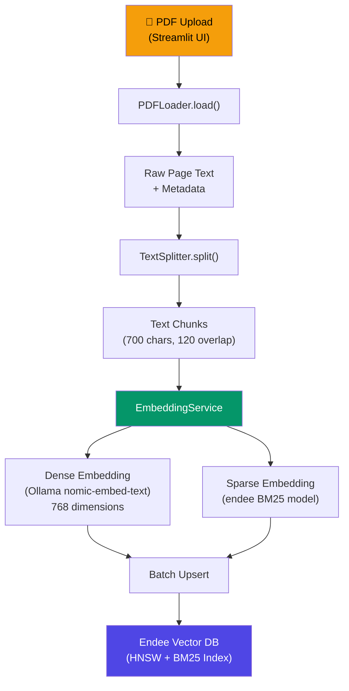
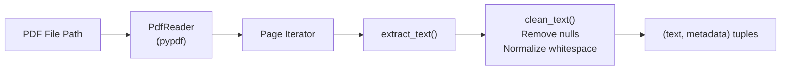
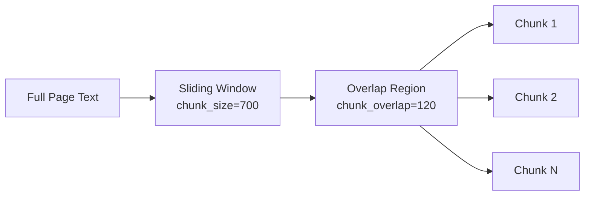
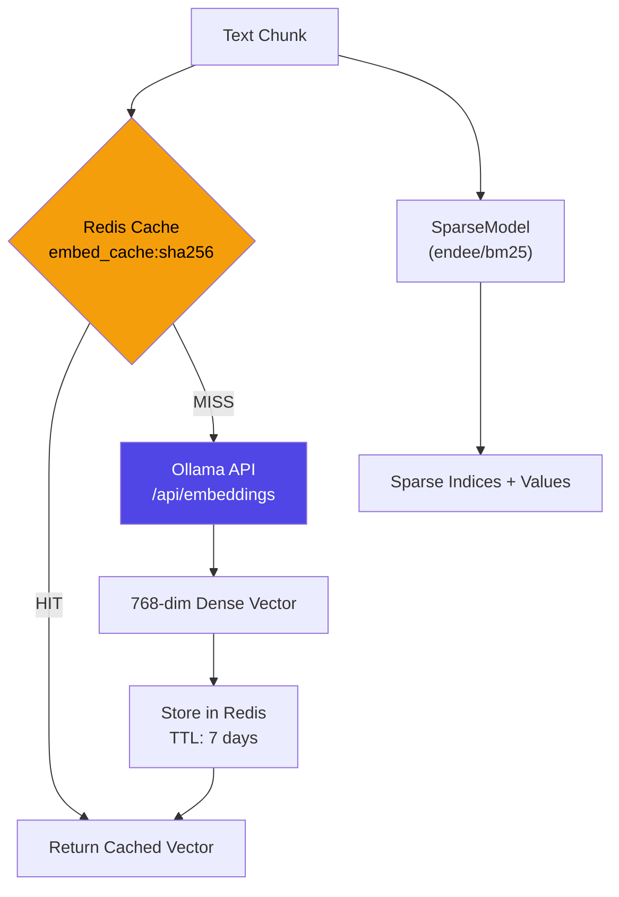
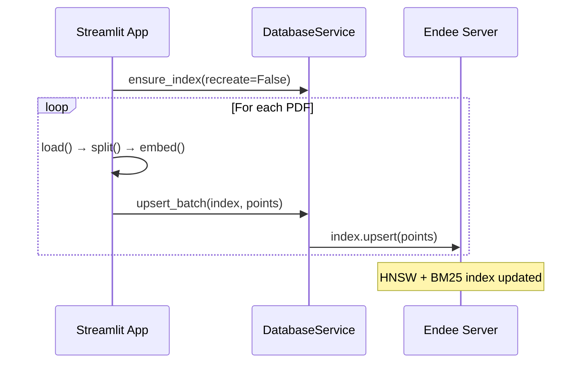

# Ingestion Pipeline

## Overview

The ingestion pipeline transforms raw PDF engineering manuals into searchable vector embeddings stored in the Endee database. It follows a **Load → Split → Embed → Store** architecture with parallel processing for high throughput.

## End-to-End Flow



## Pipeline Stages

### Stage 1: Document Loading (`core/loader.py`)



**Key Behaviors:**
- Skips pages with no extractable text
- Removes null characters (`\x00`) and collapses whitespace
- Attaches metadata: `filename`, `page`, `source`

### Stage 2: Text Splitting (`core/splitter.py`)



**Configuration:**
| Parameter | Default | Purpose |
|-----------|---------|---------|
| `chunk_size` | 700 | Characters per chunk |
| `chunk_overlap` | 120 | Overlap between adjacent chunks |

**Overlap Logic:** Ensures that sentences split at a chunk boundary are preserved in the next chunk, preventing information loss during retrieval.

### Stage 3: Embedding Generation (`core/embeddings.py`)



**Triple-Layer Caching:**
1. **LRU Cache** (`@lru_cache(128)`): In-memory, per-process
2. **Redis Cache** (`embed_cache:{sha256}`): Cross-process, 7-day TTL
3. **Parallel Batch** (`ThreadPoolExecutor`): Up to 5 concurrent embedding calls

### Stage 4: Batch Upsert



## Metadata Schema

Each ingested chunk carries the following metadata:

```json
{
  "text": "The hydraulic pump operates at...",
  "filename": "/uploads/cnc_manual.pdf",
  "page": 42,
  "source": "pdf",
  "dept": "maintenance",
  "link": "http://localhost:8003/cnc_manual.pdf"
}
```

## Performance Characteristics

| Metric | Value |
|--------|-------|
| Embedding Model | `nomic-embed-text:latest` (768-dim) |
| Sparse Model | `endee/bm25` (local, offline) |
| Embedding Cache TTL | 7 days |
| Batch Threading | 5 workers |
| Chunk Size | 700 characters |
| Overlap | 120 characters |
