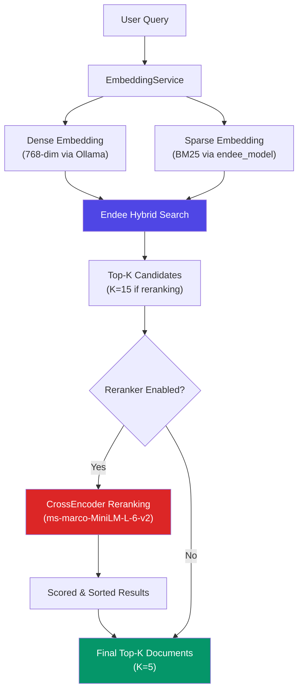
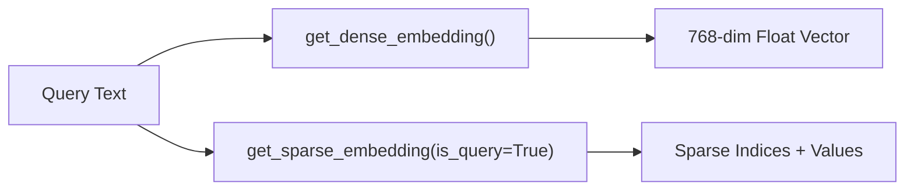
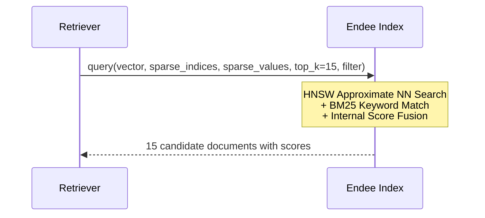
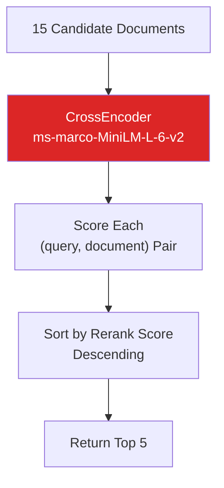
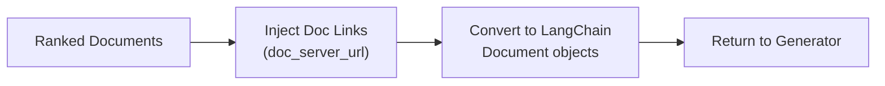
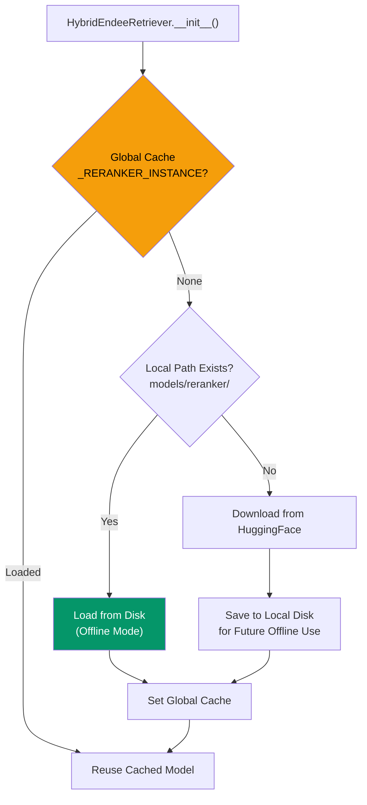

# Retrieval Pipeline

## Overview

The retrieval pipeline implements a **Hybrid Search + Cross-Encoder Reranking** strategy. It fetches candidate documents using both semantic (dense vector) and keyword (sparse BM25) matching, then reranks them with a CrossEncoder model to deliver the most precisely relevant results.

## End-to-End Flow



## Detailed Stage Breakdown

### Stage 1: Dual Embedding Generation



The query is simultaneously transformed into:
- **Dense Vector**: Captures semantic meaning via `nomic-embed-text`
- **Sparse Vector**: Captures exact keyword importance via BM25

### Stage 2: Hybrid Search on Endee



**Why Hybrid?**
- Dense search excels at understanding "What does this mean?"
- Sparse search excels at finding "Which document mentions this exact term?"
- Fusion combines both for maximum recall

### Stage 3: Cross-Encoder Reranking



**How Reranking Works:**
1. Forms `(query, document_text)` pairs for all 15 candidates
2. The CrossEncoder scores each pair independently (more accurate than bi-encoder similarity)
3. Results are sorted by this refined score
4. Only the top 5 are returned to the LLM

### Stage 4: Document Formatting



## Reranker Model Management



**Key Design Decisions:**
- **Global Singleton**: The reranker is loaded once and cached globally (`_RERANKER_INSTANCE`). This prevents expensive reloading when Streamlit reruns the script.
- **Offline-First**: The model is first checked at `models/reranker/`. If found, it loads locally. If not, it downloads from HuggingFace and saves locally for future offline deployments.

## Configuration

| Parameter | Value | Purpose |
|-----------|-------|---------|
| `top_k` | 5 | Final documents returned |
| `rerank_top_k` | 15 | Candidates fetched before reranking |
| `use_reranker` | `True` | Toggle reranking on/off |
| `reranker_model_name` | `cross-encoder/ms-marco-MiniLM-L-6-v2` | HuggingFace model |
| `reranker_model_path` | `models/reranker/` | Local cache path |

## Performance Metrics

The retriever tracks granular timing for observability:

| Metric | Description |
|--------|-------------|
| `last_retrieval_time` | Total time (hybrid + rerank) |
| `last_hybrid_time` | Time for Endee hybrid query only |
| `last_rerank_time` | Time for CrossEncoder scoring only |

These are surfaced in the Streamlit UI as:
```
🚀 Speed: 12.5 tokens/s | Latency: 2.3s | Retrieval: 0.8s (Hybrid: 0.3s, Rerank: 0.5s)
```

## Implementation: `core/retriever.py`

| Method | Description |
|--------|-------------|
| `__init__()` | Loads or downloads the CrossEncoder reranker |
| `_get_relevant_documents(query)` | Full hybrid search + rerank pipeline |

The retriever extends LangChain's `BaseRetriever`, making it compatible with the `create_history_aware_retriever` chain.
