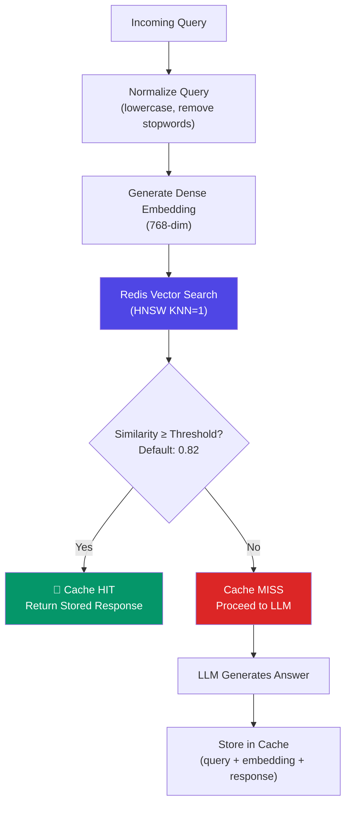
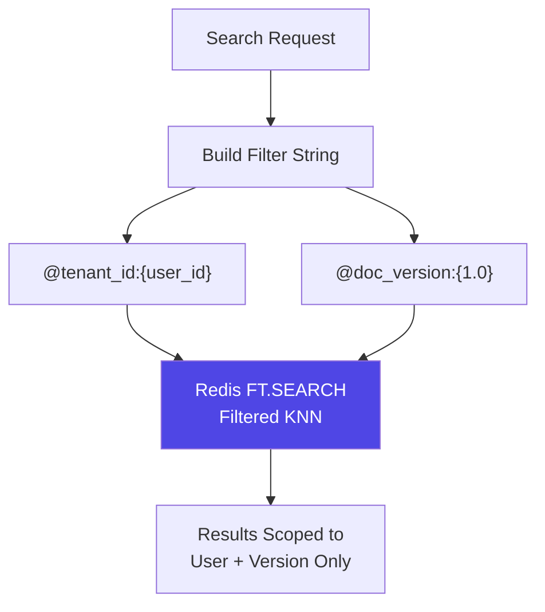
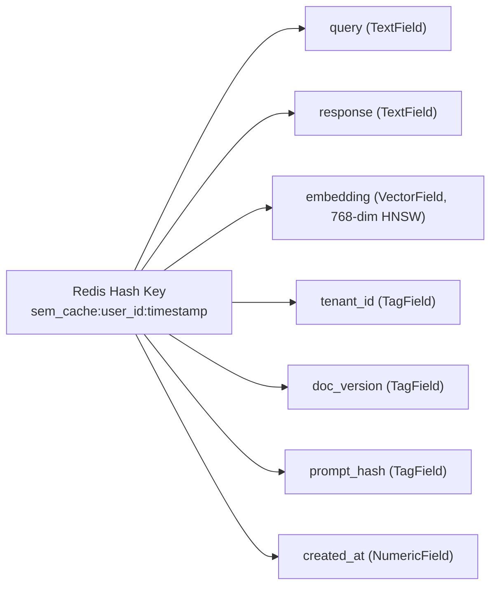
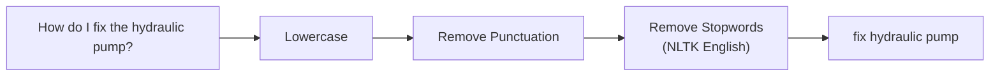
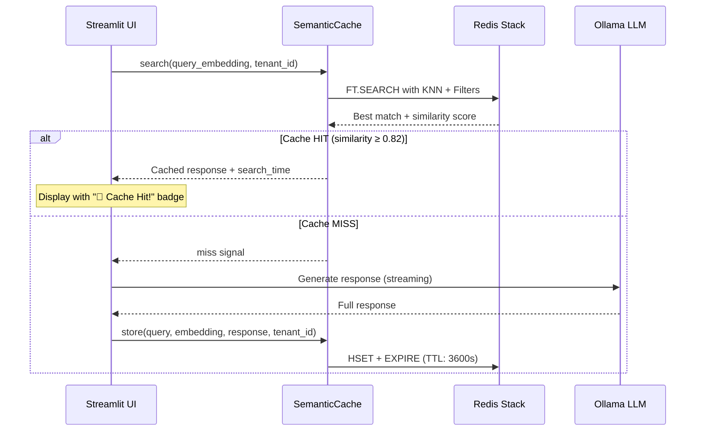

# Semantic Cache

## Overview

The Semantic Cache is a Redis Stack-powered vector similarity cache that prevents redundant LLM calls. Instead of matching queries by exact text, it uses **cosine similarity** on embedding vectors to detect semantically equivalent questions and return cached answers instantly.

## Architecture

## Multi-Tenant Isolation

**Key Principle:** User A's cached answers are **never** returned to User B. Every cache lookup is filtered by `tenant_id` (which maps to `user_id`), ensuring strict data isolation.

## Redis Index Schema

## Query Normalization

Before searching the cache, the query is normalized for better matching:

This ensures that "How do I fix the hydraulic pump?" and "Fix the hydraulic pump" hit the same cache entry.

## Cache Lifecycle

## Configuration

| Parameter | Value | Purpose |
|-----------|-------|---------|
| `semantic_cache_threshold` | `0.82` | Minimum cosine similarity for a hit |
| `semantic_cache_ttl` | `3600` | Cache entry TTL in seconds (1 hour) |
| `semantic_cache_index_name` | `semantic_cache_idx` | Redis search index name |
| `semantic_cache_prefix` | `sem_cache:` | Redis key prefix |

## Administrative Operations

| Method | Description |
|--------|-------------|
| `search()` | KNN-1 vector search with tenant/version filters |
| `store()` | Stores a new cache entry with TTL |
| `invalidate_version(version)` | Wipes all entries for a specific doc version |
| `clear_all()` | Purges the entire cache across all tenants |
| `clear_tenant(tenant_id)` | Wipes cache for a specific user |

## Performance Impact

| Scenario | Latency | LLM Cost |
|----------|---------|----------|
| Cache MISS | ~3-8 seconds (retrieval + LLM) | Full inference |
| Cache HIT | ~5-15 milliseconds | Zero |

A well-warmed cache can reduce average query latency by **95%+** for repeated engineering questions.
