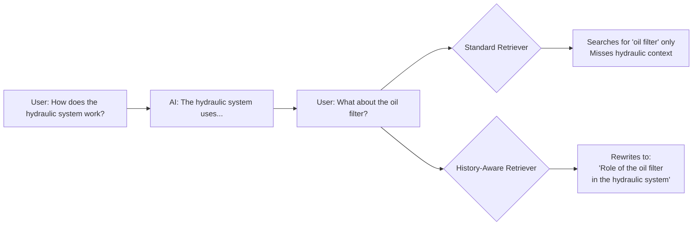
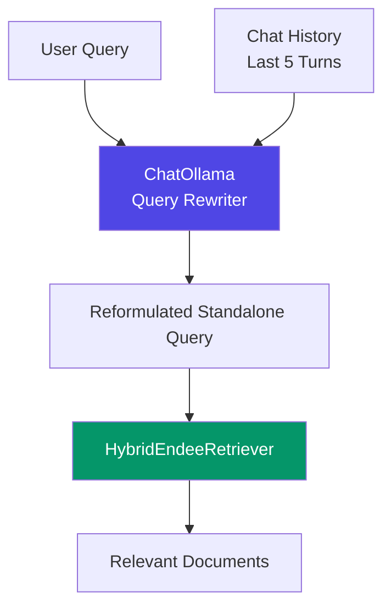
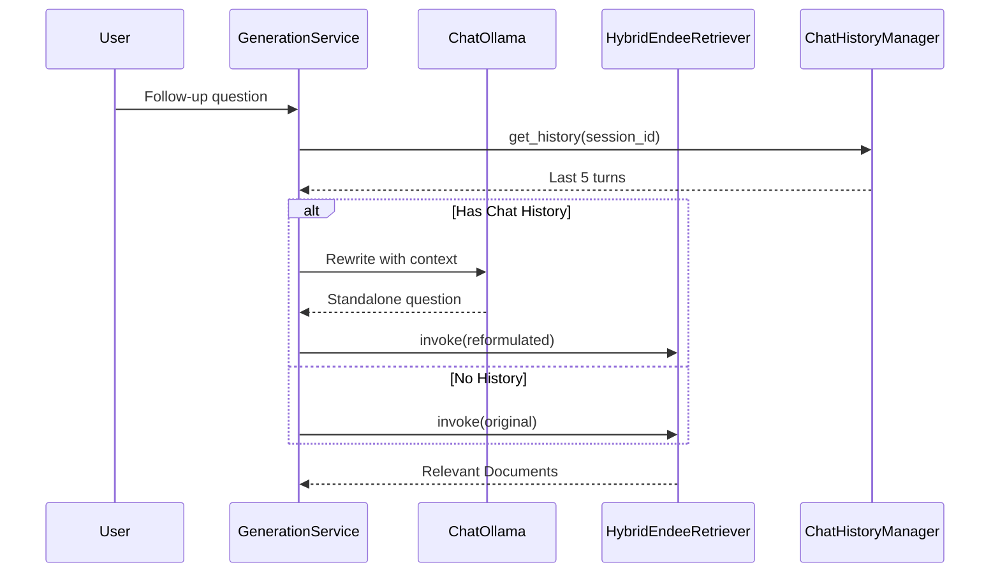
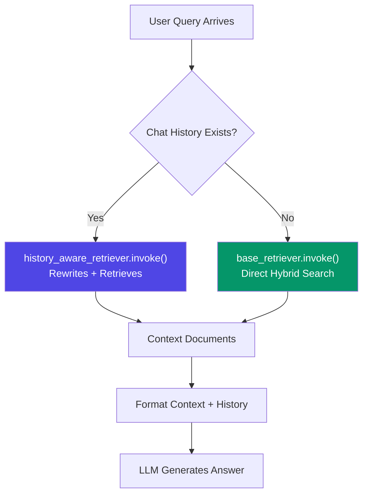

# History-Aware Retriever

## Overview

The History-Aware Retriever solves a fundamental problem in multi-turn RAG systems: **follow-up questions lack context**. When a user asks "What about the oil filter?", a standard retriever doesn't know what "that" refers to. This component uses the LLM to **rewrite ambiguous queries** into standalone questions before retrieval.

## Problem Statement

## Architecture

## Implementation Flow

## Query Rewriting Prompt

The rewriter uses a dedicated ChatOllama instance with temperature=0 for deterministic reformulation:

> **System Prompt:** Given a chat history and the latest user question which might reference context in the chat history, formulate a standalone question which can be understood without the chat history. Do NOT answer the question, just reformulate it if needed and otherwise return it as is.

## Dual-LLM Strategy

| LLM Instance | Model | Temperature | Purpose |
|---|---|---|---|
| `self.llm` (OllamaLLM) | gpt-oss:120b-cloud | 0.0 | Main answer generation with streaming |
| `self.chat_llm` (ChatOllama) | gpt-oss:120b-cloud | 0 | Query rewriting and suggestion generation |

**Why Two Instances?**
- `OllamaLLM` supports streaming for real-time token display in the UI
- `ChatOllama` handles structured message history (system/human/ai) required by LangChain's `create_history_aware_retriever` chain

## LangChain Integration

The retriever is built using LangChain's `create_history_aware_retriever`:

- Takes `chat_llm`, `base_retriever`, and a `ChatPromptTemplate` with `MessagesPlaceholder`
- Accepts `{"input": query, "chat_history": messages}` as input
- Internally rewrites the query using the LLM, then passes the standalone question to the retriever
- Returns a list of LangChain `Document` objects

## Decision Flow in Generator

## History Window Configuration

| Parameter | Value | Purpose |
|---|---|---|
| `history_window_size` | 5 | Number of conversation turns passed to the LLM prompt |
| `max_history_messages` | 10 | Maximum messages stored in Redis per session |

The history window ensures the rewriter has enough context to understand references, while the storage limit keeps Redis memory usage bounded.

## File Reference

**Implementation:** `core/generator.py` (lines 35-54)

| Component | Description |
|---|---|
| `contextualize_q_system_prompt` | System instruction for query rewriting |
| `contextualize_q_prompt` | ChatPromptTemplate with MessagesPlaceholder |
| `history_aware_retriever` | LangChain chain combining rewriter + retriever |
