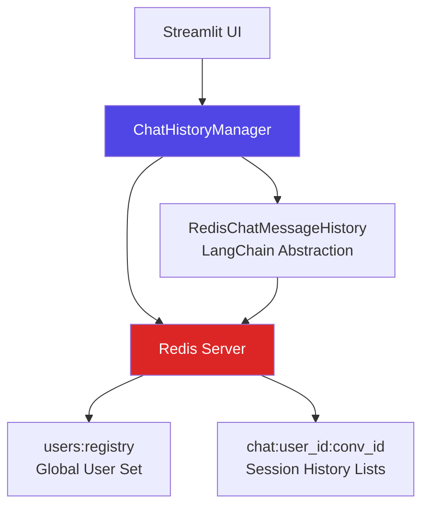
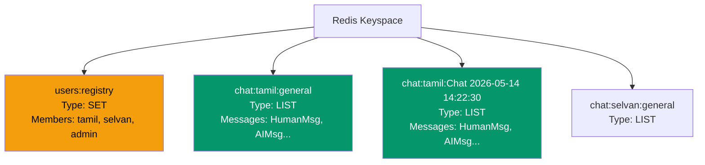
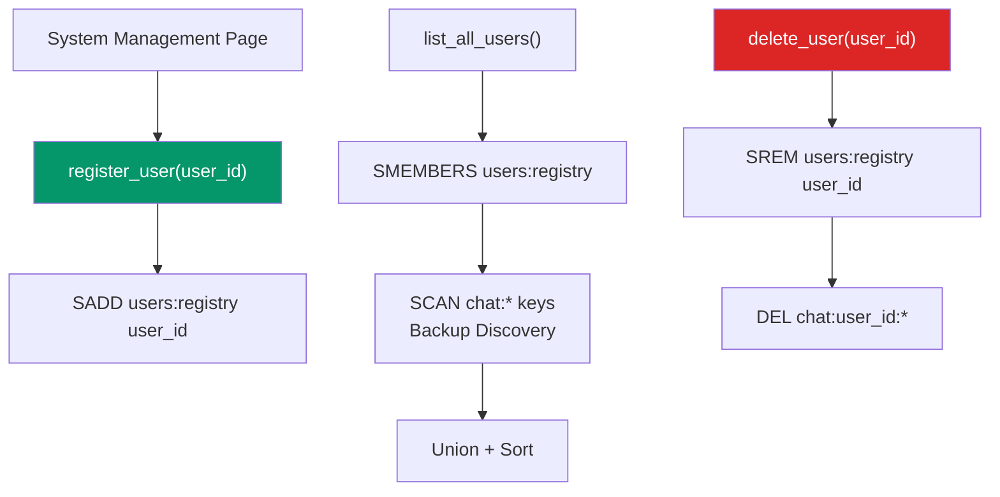
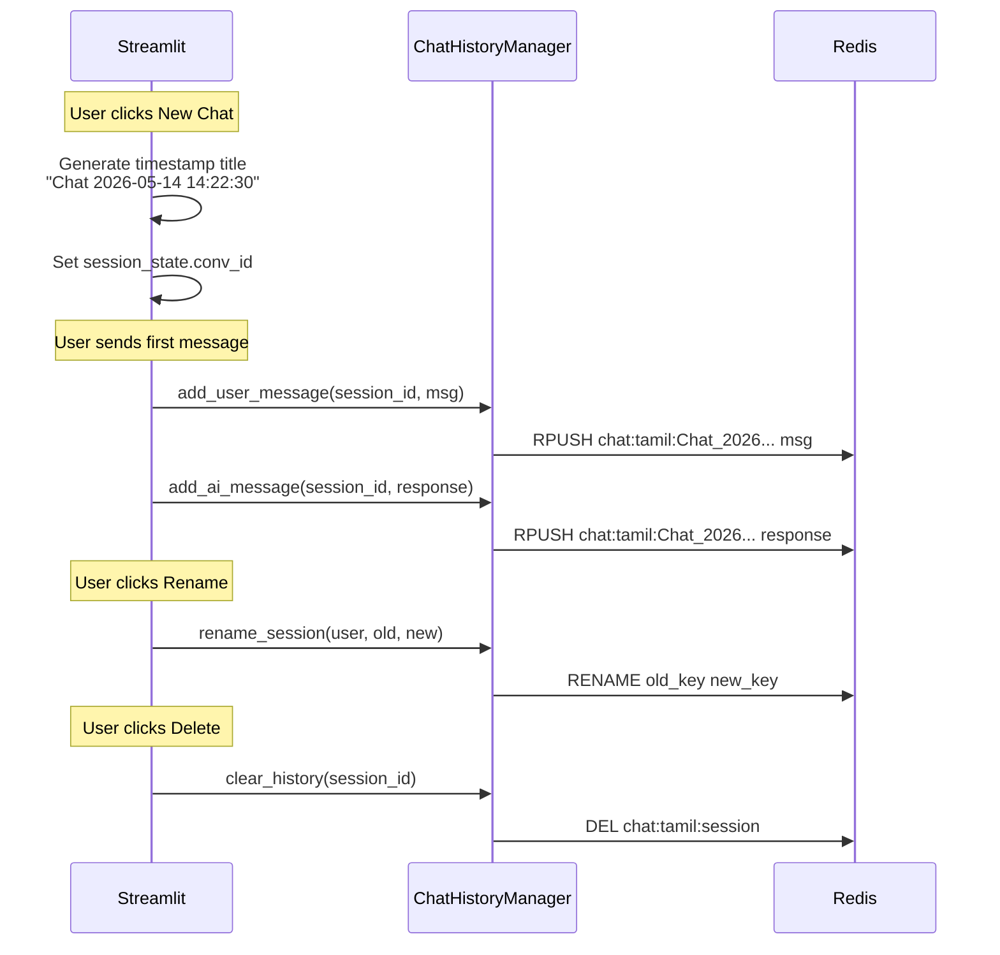
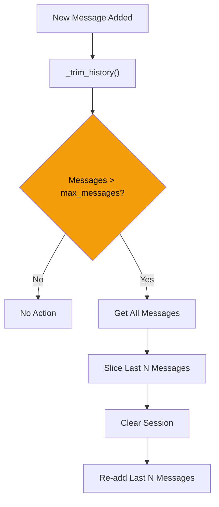

# Chat History Management

## Overview

The Chat History Management system provides **persistent, multi-user, multi-session** conversation memory using Redis. It ensures that every engineer's conversation threads are stored, retrievable, and isolated from other users, enabling context-aware responses across multiple chat sessions.

## Architecture

## Redis Key Structure

## Core Operations

### User Lifecycle

### Session Lifecycle

### History Trimming

**Max Messages:** 10 (configurable via `MAX_HISTORY_MESSAGES` in `.env`)

## Session ID Format

The session ID is constructed as: `{user_id}:{conversation_id}`

Examples:
- `tamil:general` — Default session for user "tamil"
- `tamil:Chat 2026-05-14 14:22:30` — Timestamped auto-generated session
- `selvan:hydraulic_pump_fix` — User-renamed session

## Colon Handling

Since Redis uses colons as separators and chat titles contain colons (timestamps), the system uses `split(":", 2)` (maxsplit=2) to correctly parse keys:

| Key | Prefix | User | Conv ID |
|---|---|---|---|
| `chat:tamil:general` | chat | tamil | general |
| `chat:tamil:Chat 2026-05-14 14:22:30` | chat | tamil | Chat 2026-05-14 14:22:30 |

## API Reference

### File: core/history_manager.py

| Method | Description |
|---|---|
| `get_history(session_id)` | Returns all messages for a session |
| `add_user_message(session_id, msg)` | Appends a human message |
| `add_ai_message(session_id, msg)` | Appends an AI message |
| `get_recent_messages(session_id, limit)` | Returns the last N messages |
| `clear_history(session_id)` | Deletes all history for a session |
| `clear_all_histories()` | Wipes ALL chat keys globally |
| `register_user(user_id)` | Adds user to persistent registry |
| `list_all_users()` | Returns sorted list of all known users |
| `list_user_sessions(user_id)` | Returns sorted list of session IDs for a user |
| `rename_session(user_id, old, new)` | Renames a Redis key |
| `delete_user(user_id)` | Purges user from registry + all data |

## Configuration

| Parameter | Value | Source |
|---|---|---|
| `REDIS_HOST` | localhost | .env |
| `REDIS_PORT` | 6379 | .env |
| `REDIS_PASSWORD` | (empty) | .env |
| `REDIS_CHAT_HISTORY_PREFIX` | chat: | .env |
| `MAX_HISTORY_MESSAGES` | 10 | .env |

## Data Safety

- **Defensive Deletion:** Before calling `redis.delete(*keys)`, the system always checks `if keys:` to prevent the "wrong number of arguments for DEL" error
- **Persistent Registry:** Users survive even if all their chat keys are deleted, because the registry is a separate SET
- **Cross-Session Isolation:** Each session is a separate Redis list, preventing any data mixing
