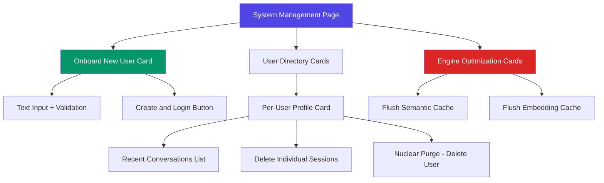
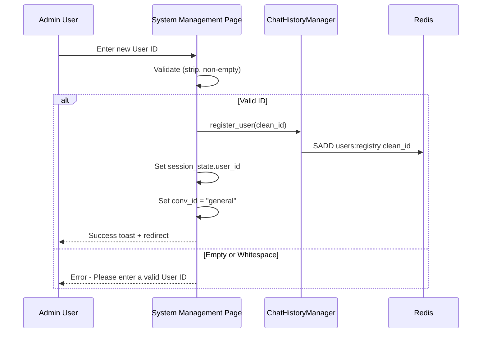
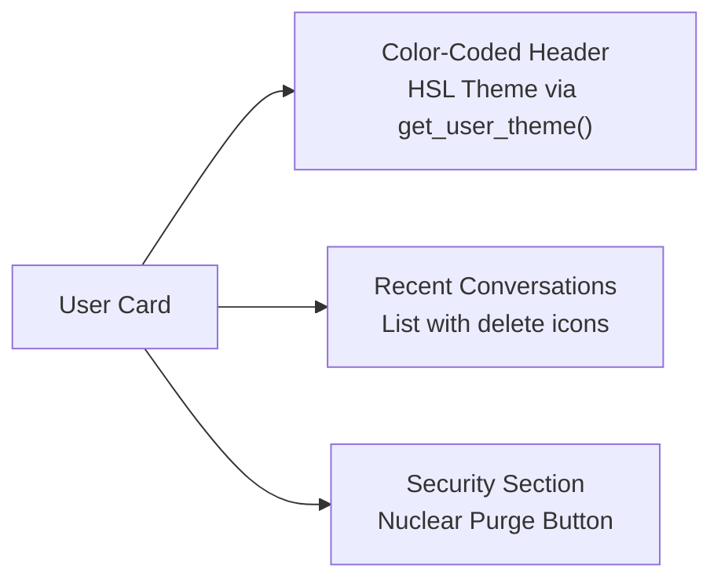
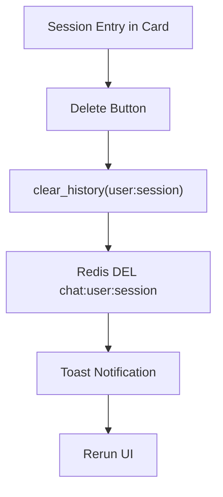
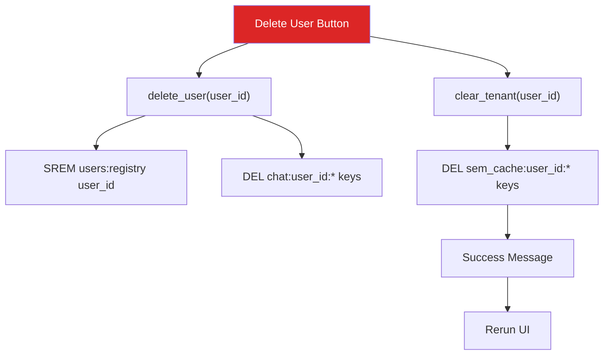
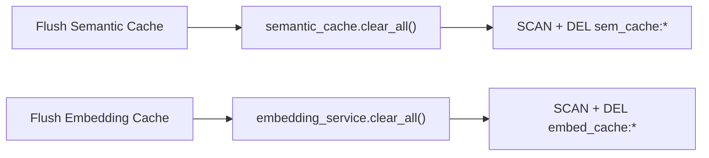

# System Management Dashboard

## Overview

The System Management page provides a centralized administrative interface for managing users, chat histories, and performance caches. It follows a card-based UI design with color-coded user profiles and granular controls for data lifecycle management.

## Dashboard Layout

## User Onboarding Flow

## User Directory

Each registered user gets a profile card with:

### HSL Theme Engine

Each user gets a unique color based on their username hash:

| Username | Hue | Primary Color |
|---|---|---|
| tamil | 127 | hsl(127, 70%, 45%) |
| selvan | 243 | hsl(243, 70%, 45%) |
| admin | 89 | hsl(89, 70%, 45%) |

This ensures visual distinction between user cards without manual color assignment.

## Administrative Actions

### Per-Session Actions

### Per-User Nuclear Purge

### Global Cache Optimization

## Sidebar vs Management Page

| Feature | Sidebar | System Management |
|---|---|---|
| Create New User | No | Yes |
| Switch User | Yes (dropdown) | No |
| Create New Chat | Yes (plus icon) | No |
| Rename Chat | Yes | No |
| Delete Chat | Yes | Yes (per-user cards) |
| Delete User | No | Yes (Nuclear Purge) |
| Flush Caches | No | Yes |

## Access Control Design

- Only existing registered users appear in the sidebar dropdown
- New users must be created through the System Management page
- This prevents accidental user creation and ensures administrative oversight
- Empty or whitespace-only User IDs are rejected with validation

## Configuration

All management operations are powered by the ChatHistoryManager class in `core/history_manager.py` and the RedisSemanticCache class in `core/semantic_cache.py`.
