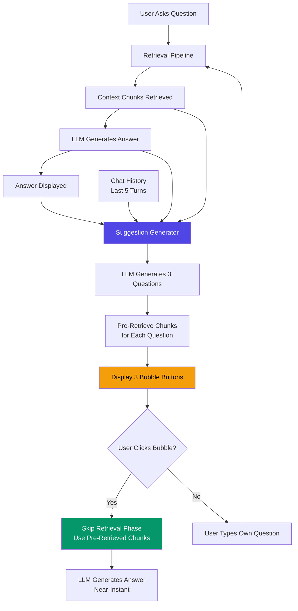
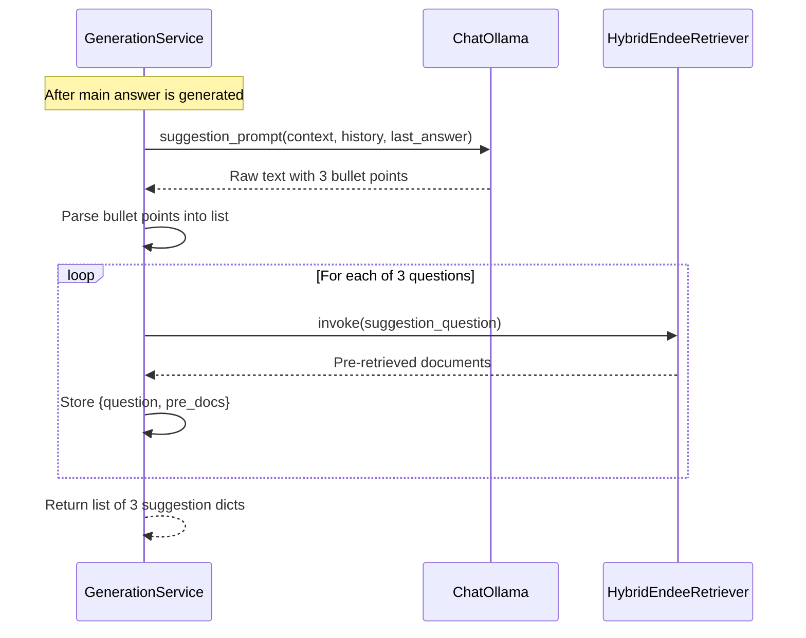
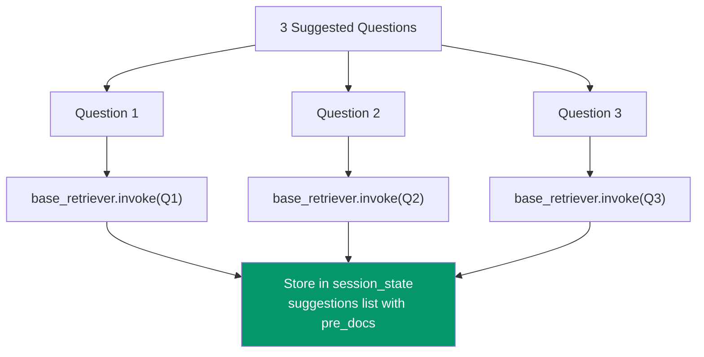
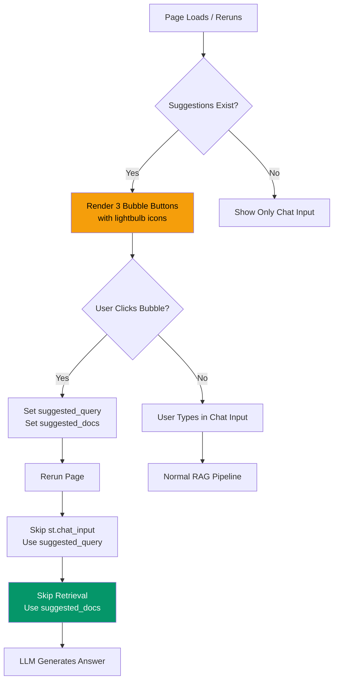
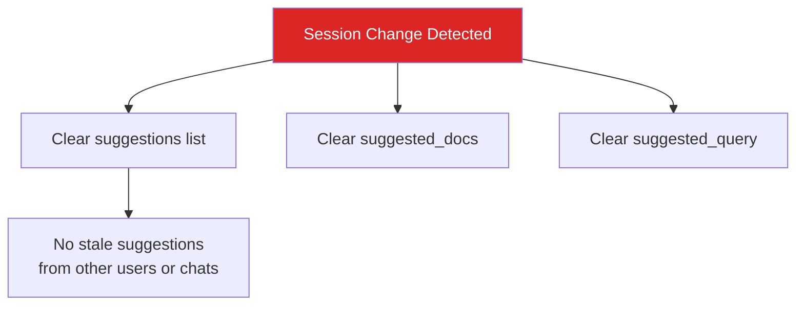

# Question Suggestions After Response

## Overview

The Question Suggestion system provides an intelligent, context-aware follow-up experience. After every AI response, the system generates 3 strategic follow-up questions based on the retrieved document chunks and conversation history. Each suggestion comes with **pre-retrieved context chunks**, enabling near-instant responses when clicked.

## End-to-End Flow

## Suggestion Generation Pipeline

## Suggestion Prompt Design

The prompt is carefully engineered to generate questions that are:
1. **Answerable** from the existing technical documentation
2. **Relevant** to the current conversation thread
3. **Strategic** — helping users explore deeper into the topic

The prompt receives:
- **Context (Retrieved Chunks):** The same document snippets used to answer the current question
- **Conversation History:** Last 5 turns for topic continuity
- **AI's Last Response:** To avoid suggesting the same question that was just answered

## Pre-Retrieval Strategy

**Why Pre-Retrieve?**
- Eliminates the retrieval phase latency (typically 0.3-0.8s) when the user clicks a suggestion
- The UI shows a lightning bolt indicator when pre-retrieved context is used
- If the user types their own question instead, normal retrieval proceeds as usual

## UI Interaction Flow

## Session Isolation

Suggestions are automatically cleared when:
- The user switches to a different User ID
- The user switches to a different Chat Session
- A new chat is created via the plus icon

## Data Structure

Each suggestion is stored as a dictionary:

| Field | Type | Description |
|---|---|---|
| question | str | The suggested follow-up question text |
| pre_docs | List of Document | Pre-retrieved LangChain Document objects |

## Performance Comparison

| Scenario | Retrieval Time | Total Latency |
|---|---|---|
| Normal Question (typed) | 0.3 - 0.8s | 3 - 8s |
| Suggestion Click (pre-retrieved) | ~0.01s | 2 - 6s |
| Cache Hit | 0s | 0.005 - 0.015s |

## File References

| File | Component |
|---|---|
| core/generator.py | suggestion_prompt, generate_suggestions() |
| streamlit_app.py | Bubble button rendering, suggested_query handling |
