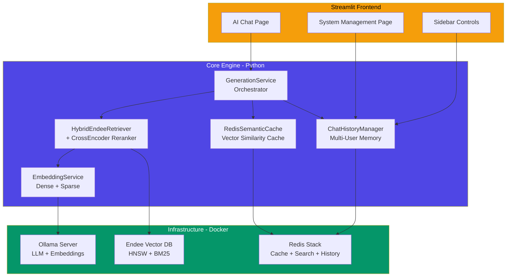
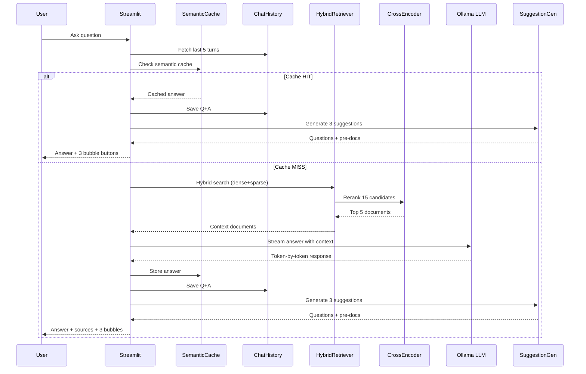
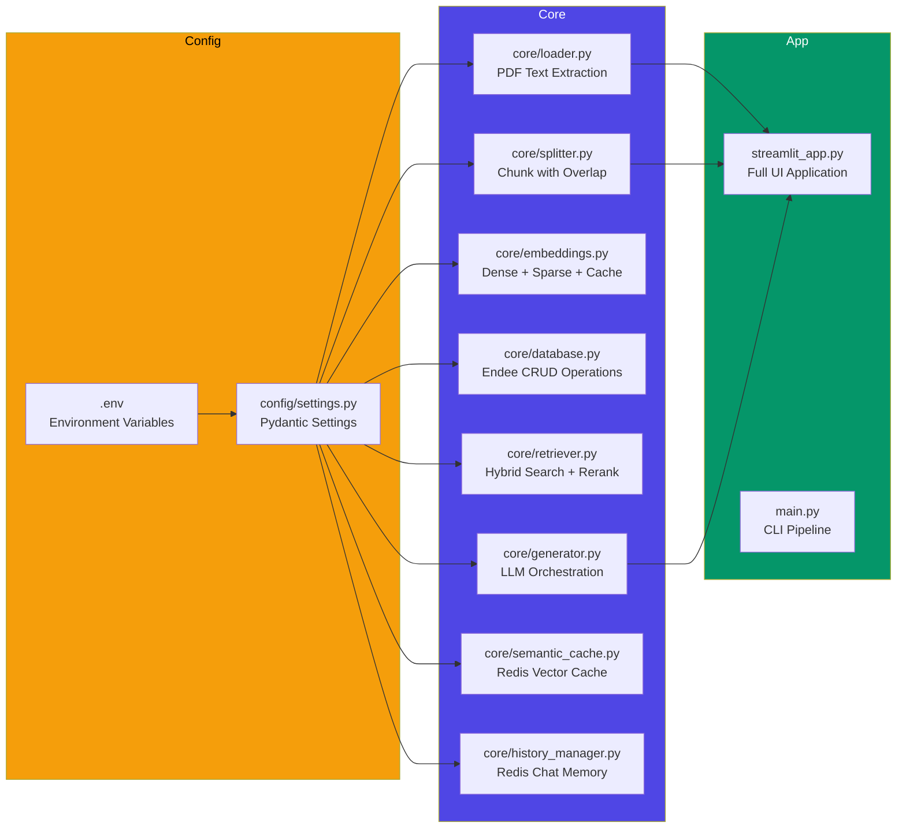
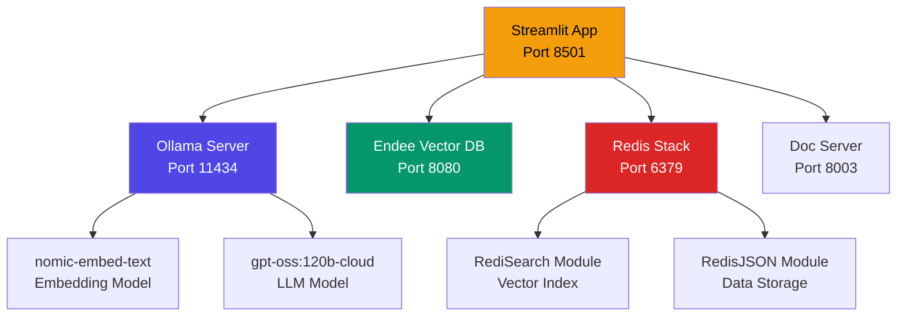
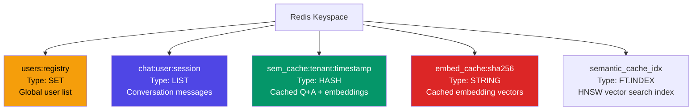
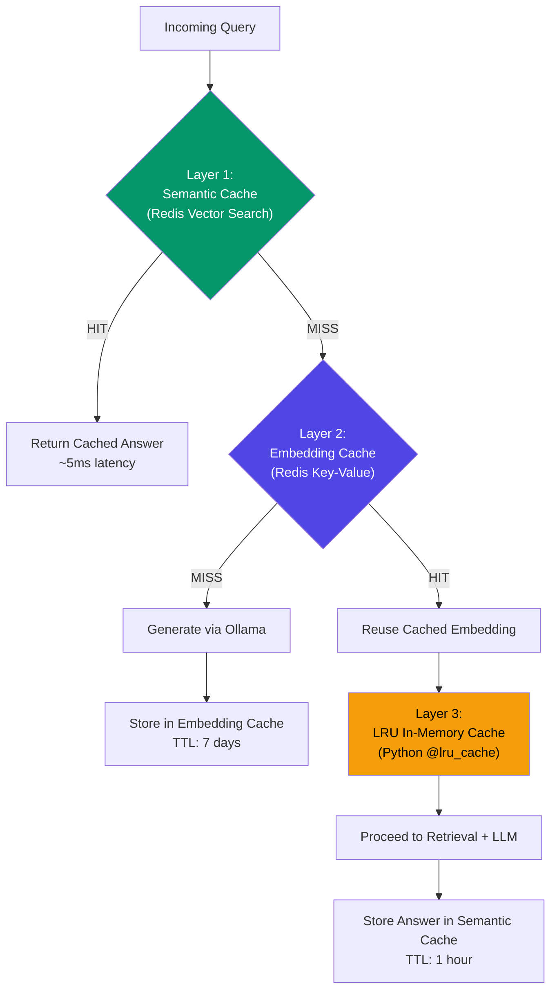
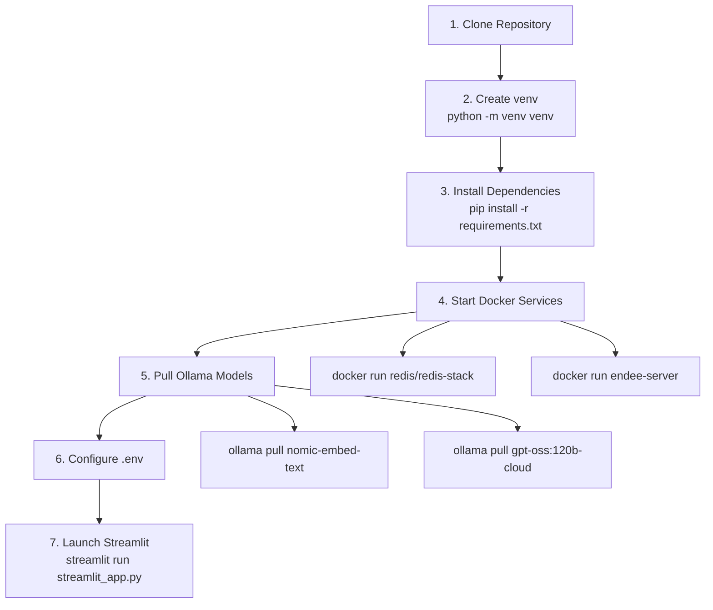

# Entire System Setup - Complete Architecture

## Overview

This is a **100% offline, production-grade, multi-tenant RAG system** built with Ollama, Endee Vector Database, Redis Stack, and Streamlit. It transforms engineering PDF manuals into an intelligent Q&A assistant with semantic caching, conversation memory, and administrative controls.

## System Architecture

## Request Lifecycle

## Component Map

## Infrastructure Services

### Service Dependency Map

### Port Configuration

| Service | Port | Purpose |
|---|---|---|
| Streamlit | 8501 | Web UI |
| Ollama | 11434 | LLM + Embeddings API |
| Endee | 8080 | Vector Database |
| Redis Stack | 6379 | Cache + History + Search |
| Doc Server | 8003 | PDF file serving for source links |

## Redis Namespace Map

## Caching Strategy - Triple Layer

## Environment Configuration

### .env File Structure

| Section | Variables |
|---|---|
| **Ollama** | OLLAMA_URL, OLLAMA_EMBED_MODEL, OLLAMA_LLM_MODEL |
| **Endee** | ENDEE_URL, ENDEE_INDEX_NAME |
| **RAG** | TOP_K, DOC_SERVER_URL, NLTK_DATA_PATH |
| **Redis Cache** | REDIS_HOST, REDIS_PORT, REDIS_PASSWORD, SEMANTIC_CACHE_THRESHOLD, SEMANTIC_CACHE_TTL |
| **Redis History** | REDIS_CHAT_HISTORY_PREFIX, MAX_HISTORY_MESSAGES |
| **Redis Embeddings** | REDIS_EMBED_CACHE_PREFIX, EMBED_CACHE_TTL |

### Pydantic Settings (config/settings.py)

All environment variables are loaded via Pydantic BaseSettings with:
- Type validation (str, int, float, bool)
- Default values for every parameter
- Automatic .env file loading
- extra="ignore" to prevent crashes from unknown variables

## Setup Steps

### Prerequisites

1. Python 3.11+ with venv
2. Docker and Docker Compose
3. Ollama installed locally

### Installation

### Docker Services

| Service | Image | Ports |
|---|---|---|
| Redis Stack | redis/redis-stack:latest | 6379, 8001 (RedisInsight) |
| Endee Server | endee-server:latest | 8080 |

## Offline Deployment

This system is designed to run 100% offline:

- **LLM:** Ollama runs locally with downloaded model weights
- **Embeddings:** nomic-embed-text runs locally via Ollama
- **Sparse Model:** endee/bm25 is a local model file
- **Reranker:** CrossEncoder is downloaded once and saved to models/reranker/ for offline reuse
- **Vector DB:** Endee runs as a local Docker container
- **Cache/History:** Redis runs as a local Docker container
- **No external API calls** are made during operation

## Documentation Index

| # | Document | Description |
|---|---|---|
| 01 | endee_vector_database.md | Endee DB architecture, HNSW config, hybrid queries |
| 02 | ingestion_pipeline.md | PDF loading, chunking, embedding, batch upsert |
| 03 | retrieval_pipeline.md | Hybrid search, CrossEncoder reranking, metrics |
| 04 | semantic_cache.md | Redis vector cache, multi-tenant isolation, TTL |
| 05 | history_aware_retriever.md | Query rewriting, dual-LLM strategy, LangChain chain |
| 06 | chat_history_management.md | Redis persistence, user registry, session lifecycle |
| 07 | system_management.md | Admin dashboard, user onboarding, cache flushing |
| 08 | question_suggestions.md | Follow-up generation, pre-retrieval, bubble UI |
| 09 | entire_setup.md | This document - complete system overview |
