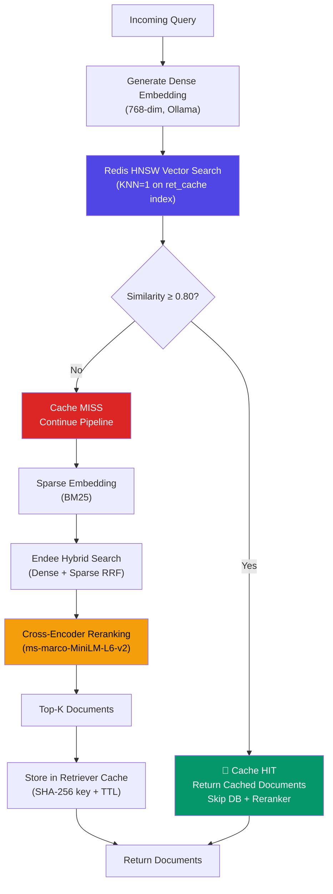
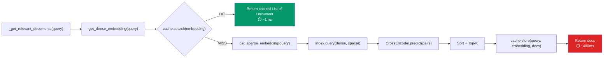
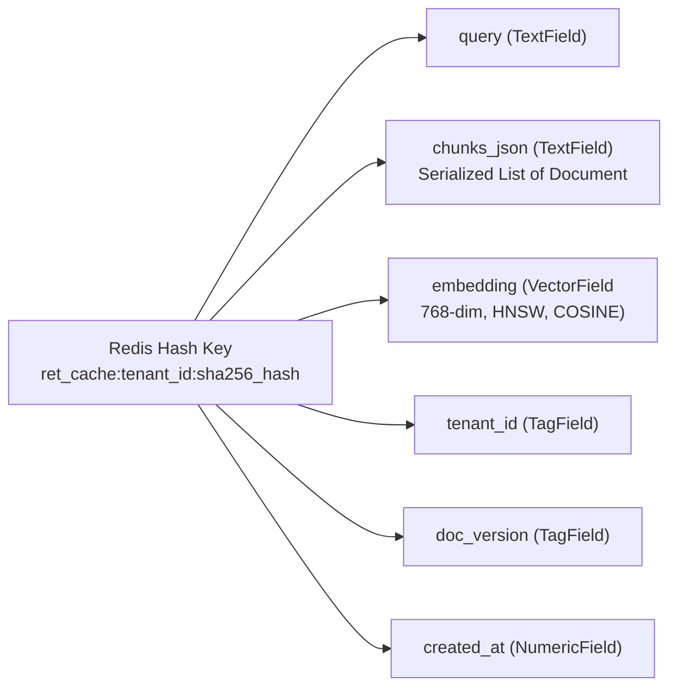
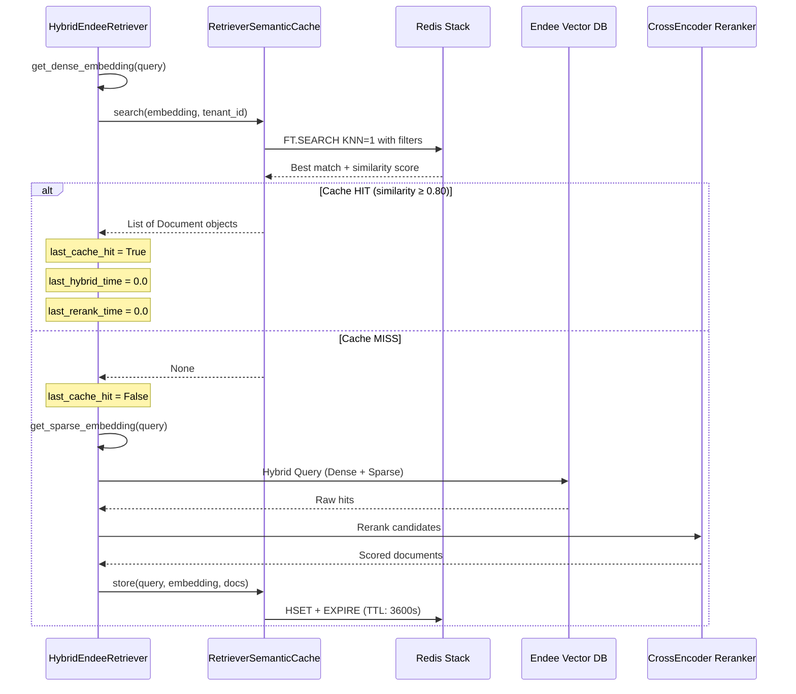
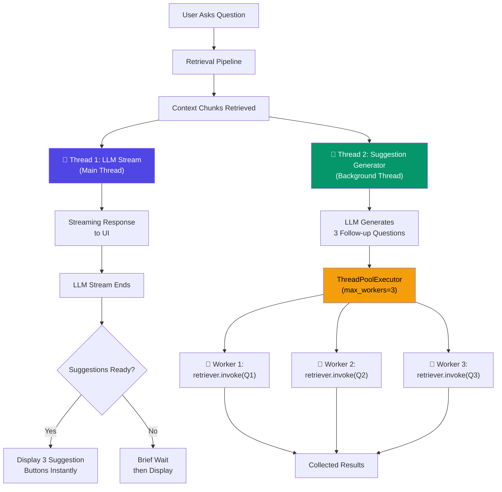
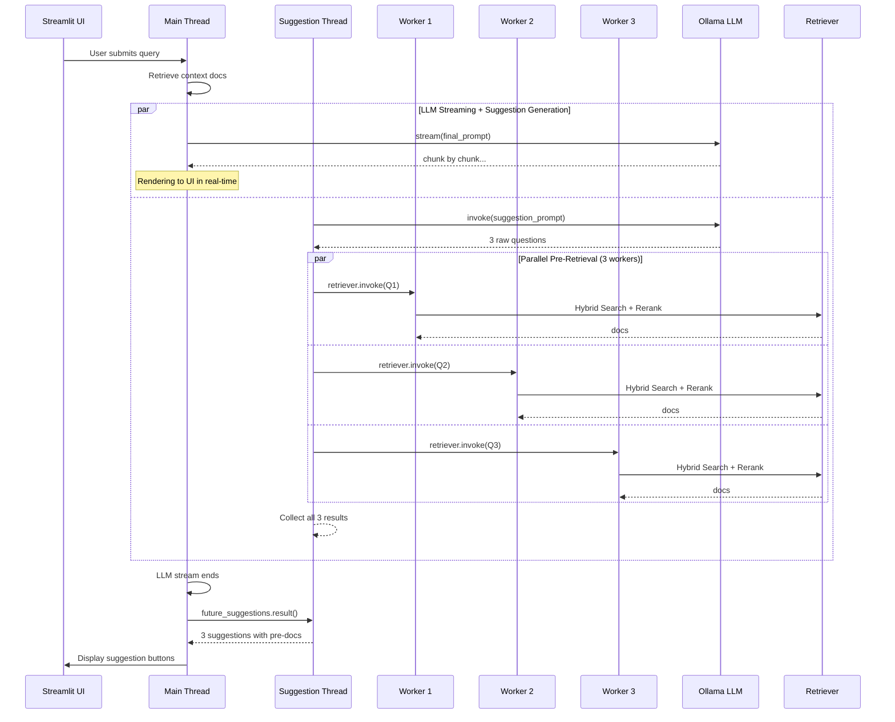
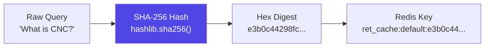
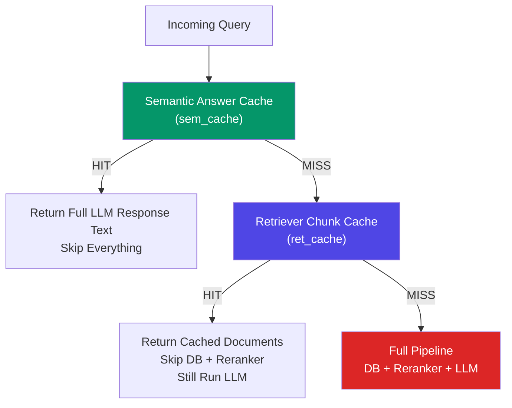
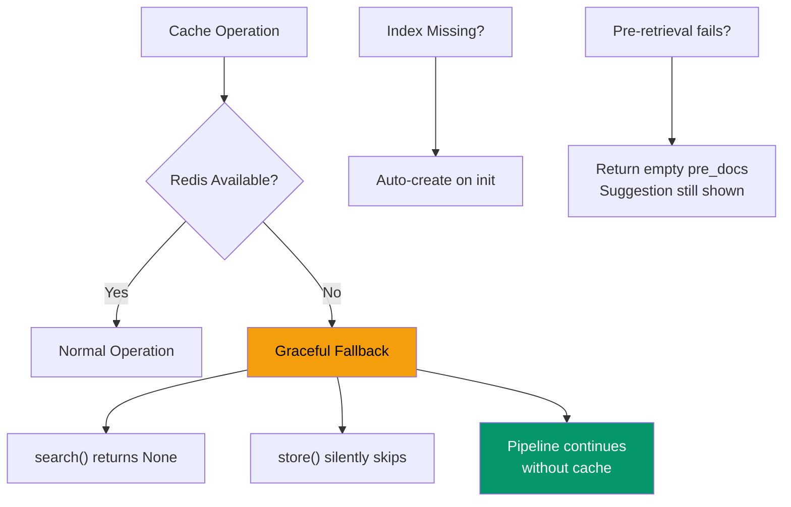

# Semantic Retriever Cache & Parallelized Pre-Retrieval

## Overview

The **Retriever Semantic Cache** is a Redis Stack-powered caching layer that stores the final **reranked document chunks** (not LLM answers) for a given query embedding. When a semantically similar query arrives, the system skips both the **Endee Hybrid Search** and the **Cross-Encoder Reranking** phases entirely, returning cached `Document` objects in under 2ms.

The **Parallelized Pre-Retrieval** system runs follow-up suggestion generation concurrently with the main LLM response stream, and internally parallelizes the 3 individual chunk retrievals needed for each suggestion.

Together, these features reduce retrieval latency by **~400x** and eliminate perceived wait time for follow-up suggestions.

## Architecture — Retriever Cache



## Cache vs No-Cache — Decision Flow



## Redis Index Schema — Retriever Cache



### Serialization Format

Documents are serialized to JSON for storage and reconstructed on retrieval:

```python
# Storing
chunks_data = [
    {"page_content": doc.page_content, "metadata": doc.metadata}
    for doc in documents
]
json.dumps(chunks_data)

# Retrieving
data = json.loads(chunks_json)
docs = [
    Document(page_content=d["page_content"], metadata=d["metadata"])
    for d in data
]
```

This preserves all metadata fields including `filename`, `page`, `link`, `rerank_score`, and `chunk_id`.

## Cache Lifecycle



## Parallelized Pre-Retrieval Architecture



## Two-Tier Concurrency Model



## Key Hashing Strategy



**Why SHA-256 instead of Python's `hash()`?**
- Python's `hash()` returns different values across process restarts (randomized by default since Python 3.3)
- SHA-256 is deterministic, ensuring cached entries remain valid across app restarts and container recreation

## Configuration

| Parameter | Value | Purpose |
|---|---|---|
| `retriever_cache_enabled` | `True` | Feature toggle for the retriever cache |
| `retriever_cache_threshold` | `0.80` | Minimum cosine similarity for a cache hit |
| `retriever_cache_ttl` | `3600` | Cache entry TTL in seconds (1 hour) |
| `retriever_cache_index_name` | `retriever_cache_idx` | Redis search index name |
| `retriever_cache_prefix` | `ret_cache:` | Redis key prefix for all cache entries |

## Persistent UI Metrics

Every assistant response in the chat history includes a persistent metrics bar:

| Metric | Description |
|---|---|
| 🚀 tokens/s | LLM generation throughput |
| Latency | Total end-to-end response time |
| Retriever Cache | ✅ HIT or ❌ MISS — whether cached chunks were used |
| Answer Cache | ✅ HIT or ❌ MISS — whether the semantic answer cache was used |
| ⏱️ Retrieval | Breakdown: Hybrid Search time + Rerank time |

These metrics are stored in the message dictionary and survive across page reruns and session reloads.

## Administrative Operations

| Method | Location | Description |
|---|---|---|
| `search(embedding, tenant_id)` | `retriever_cache.py` | KNN-1 vector search with tenant/version filters |
| `store(query, embedding, docs)` | `retriever_cache.py` | Serializes and stores Document list with TTL |
| `clear_all()` | `retriever_cache.py` | Purges all retriever cache entries |
| `generate_suggestions()` | `generator.py` | Parallel suggestion generation + pre-retrieval |

## Performance Comparison

| Scenario | Retrieval Latency | Rerank Latency | Total Retrieval | Improvement |
|---|---|---|---|---|
| **No Cache (Cold)** | ~200ms | ~150ms | ~400ms | Baseline |
| **Retriever Cache HIT** | ~1ms | 0ms (skipped) | ~1ms | **~400x faster** |
| **Suggestion Pre-Retrieval (Sequential)** | — | — | ~1200ms (3 × 400ms) | Baseline |
| **Suggestion Pre-Retrieval (Parallel)** | — | — | ~400ms (max of 3) | **~3x faster** |
| **Suggestion Pre-Retrieval (All Cached)** | — | — | ~3ms (max of 3 × 1ms) | **~400x faster** |

## Difference from Semantic Answer Cache



| Feature | Semantic Answer Cache | Retriever Chunk Cache |
|---|---|---|
| **What is cached** | Final LLM response text | Reranked List of Document objects |
| **What is skipped on HIT** | Retrieval + Reranking + LLM | Retrieval + Reranking only |
| **LLM still runs?** | No | Yes (fresh answer from cached context) |
| **Threshold** | 0.82 | 0.80 |
| **TTL** | 3600s (1 hour) | 3600s (1 hour) |
| **Key prefix** | `sem_cache:` | `ret_cache:` |
| **Index name** | `semantic_cache_idx` | `retriever_cache_idx` |

## Error Handling & Resilience



All cache operations are wrapped in `try/except` blocks. If Redis is unavailable or the index is corrupted, the system gracefully falls back to the standard retrieval pipeline with zero user-facing errors.

## File References

| File | Component |
|---|---|
| `core/retriever_cache.py` | `RetrieverSemanticCache` — full cache implementation |
| `core/retriever.py` | `HybridEndeeRetriever` — cache integration in `_get_relevant_documents()` |
| `core/generator.py` | `generate_suggestions()` — parallelized pre-retrieval with `ThreadPoolExecutor` |
| `config/settings.py` | Retriever cache configuration parameters |
| `streamlit_app.py` | Parallel suggestion thread launch + persistent metrics rendering |
